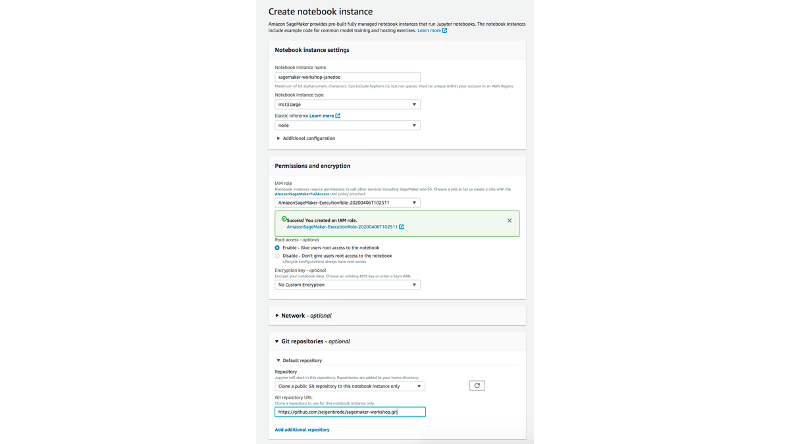
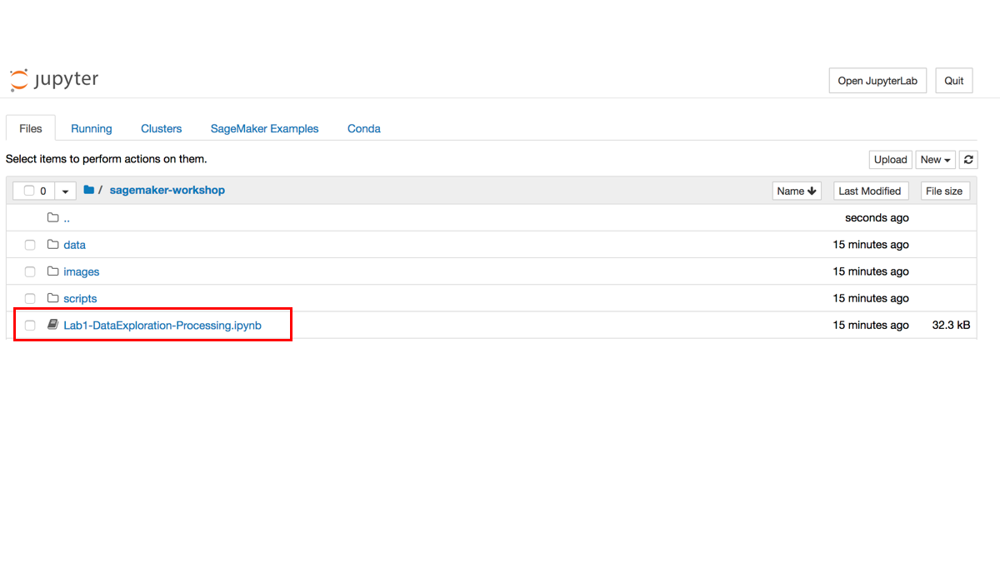

# SageMaker Workshop

  **Description:** This workshop was created to walk users through the end-to-end process and considerations for utilizing SageMaker for Machine Learning. The workshop focuses on a usecase of predicting whether a transaction is likely to be a recurring payment (i.e. subscription, membership).  
  
 The workshop is broken into 3 Labs with an additional step for lab setup: 
 
   * Lab Setup
   * Lab 1: Data Exploration & Processing
   * Lab 2: Training
   * Lab 3: Hosting and Evaluating
    
 ---
 
 ## Lab Setup
    
   ### Login to your AWS Account 
   
   1) Click on the Event Engine URL that is provided by your moderators
   2) One person on your team should perform the following to set your team name:
      * click **Set Team Name** and enter a Team Name (Be Creative!)
      * click **Set Team Name** green button on the bottom left to confirm
      
   3) Click on **AWS Console** followed by **Open AWS Console** to login to your lab account
   4)  Once logged in, ensure that you are on the US East (N.Virginia) us-east-1 region. You can verify this by checking the upper right hand corner showing the regions.
   
   ### Create SageMaker Notebook Instance 
   
   1) Go to [Amazon SageMaker Service](https://console.aws.amazon.com/sagemaker/)
   2) Ensure you are in *us-east-1/N.Virginia*
   3) Select **Notebook instances** from the left menu
   4) Select **Create notebook instance** in the upper right corner
   5) Under *Notebook Instance Settings*, complete/update the following:
       * **Notebook instance name:** Enter a name for the notebook instance (Ex: sagemaker-workshop-janedoe)
       * **Notebook instance type:** ml.t3.large
   6) Under *Permissions and encryption*, complete/update the following:
       * **IAM Role:** Create a new role --> Select 'any S3 bucket' --> Create Role
   7) Under *Git Repositories*:
       * select 'Clone a public git repository to this notebook instance only' from the dropdown
       * Enter 'https://github.com/seigenbrode/sagemaker-workshop/' under *Git Repository URL*
       
   8) Leave all other sections using default settings, then click **Create notebook instance**
   9) It will take a few moments for the **Status** to change to **InService**
   10) Once the notebook is showing **InService**, click the **Open Jupyter** link to open your hosted notebook instance
   
 ---
 
 For today's labs we will be working inside Jupyter Notebooks.  If you are unfamiliar with Jupyter below are a few quickstart resources you can review or reach out to your moderator for assistance: 
 
   * [Jupyter Notebook Cheatsheet](https://www.edureka.co/blog/cheatsheets/jupyter-notebook-cheat-sheet)
    
   * [Basics of Jupyter Notebooks](https://towardsdatascience.com/a-beginners-tutorial-to-jupyter-notebooks-1b2f8705888a)
 
 ## Lab 1: Data Exploration & Processing  
   
 From within the notebook instance we created in Lab Setup above:
 
   1) Go to the **Files** tab
   2) Click **sagemaker-workshop**
   3) Click **Lab1-DataExploration-Processing.ipynb** to open Lab 1
   4) The remaining steps for this lab are performed within the notebook instance
   
   
---
 
 ## Lab 2: Training
   
 From within the notebook instance we created in Lab Setup above:
 
   1) Go to the **Files** tab
   2) Click **sagemaker-workshop**
   3) Click **Lab2-Training.ipynb** to open Lab 2
   4) The remaining steps for this lab are performed within the notebook instance
   
---
 
 ## Lab 3: Hosting & Evaluation
   
 From within the notebook instance we created in Lab Setup above:
 
   1) Go to the **Files** tab
   2) Click **sagemaker-workshop**
   3) Click **Lab3-Hosting-Evaluuation.ipynb** to open Lab 3
   4) The remaining steps for this lab are performed within the notebook instance
       
